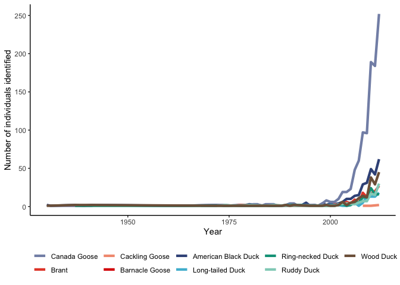
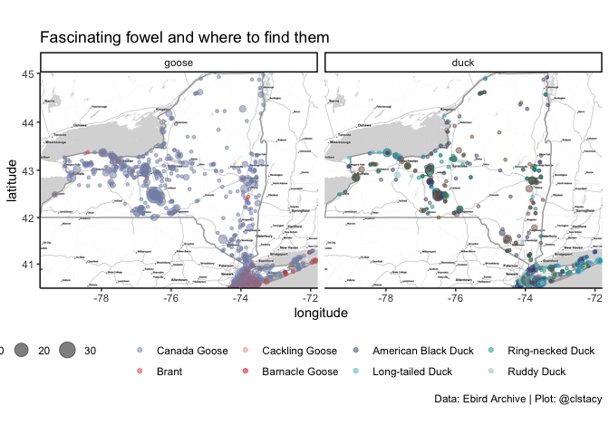
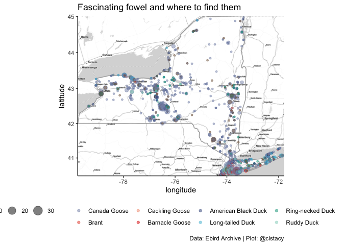

Scientific Computing for Biologists - Assignment 1
================
Carson Stacy
2022-09-28

# Duck, Duck, Goose?

## An anatidaephobic’s guide to the state of New York

Some people are afraid of ducks and geese, and I don’t blame them. They
are horrifying little honkers. Thankfully, with the help of the
crowdsourced Ebird dataset maintained by Cornell University, we can
learn more about where these menaces are most often seen so they can be
properly avoided.

## You’re not crazy, it is getting worse!

As you can see in figure 1 below, the number of spottings of these birds
are on the rise. If this pattern continues, we will soon be inundated
with human-goose conflict.

    ## `summarise()` has grouped output by 'name'. You can override using the
    ## `.groups` argument.

<!-- -->

<!-- --><!-- -->
